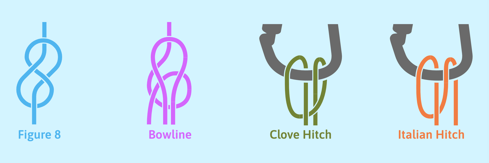

# Knots
> learn how to tie about 2 climbing knots as that is all you will ever need!
> Relies on css shape morphing for smooth morphing of svgs that still only works in Google Chrome. Not a nice experience in other browsers unfortunately.
[View on Github Pages](https://martinbagshaw.github.io/knots/)

## Stack
- React, react-router, react-router-dom
- Styled Components
- Typescript (TODO)

## Figma Prototype
[can be found here](https://www.figma.com/proto/GPZh3JwWvqXSRKI0Lc4kqSa9)

---

### Resources that have helped:
- https://css-tricks.com/svg-shape-morphing-works/
- https://www.sarasoueidan.com/blog/svg-tips-for-designers/
- https://github.com/juliangarnier/anime/issues/256

### Method and Tools
1. Make SVG file in illustrator or figma
2. Split up path parts to only go through 180 degrees, and not have an 's' shape. This will ensure morph 
doesn't cross over / look weird
3. Use https://editor.method.ac/ - for further path editing 
4. Use https://shapeshifter.design/ - for SVG path normalisation. To morph correctly (Google Chrome only
at present), the same number of points or instructions in the from and to paths are required.

---

## TODO
> See KnotView.js for more detail
1. redo detailed figure 8 svg:
-  Orange rope to be longer (includes half of mint part)
-  Other half of mint part attached to green part
-  left buckle to have right segment on top
-  right buckle to have left segment on bottom

2. in-knot routing - is this possible?

3. once at a stable point, introduce typescript
